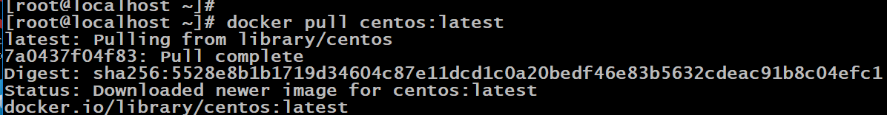

# **Deploying a Machine Learning Model Inside a Docker Container**

First of all, thank you for reading this article. Many of us might not be familiar with Docker. I hope by reading this article, you’ll gain insights into Docker and container technology.

## **Why Do We Need a System?**

We need systems to run programs, which require an operating system (OS) and physical hardware (RAM, CPU, HDD) to function. Previously, setting up a server on a virtual machine (VM) or over cloud computing took 10 to 15 minutes, involving booting and logging in. This delay impacted market delivery times.

Docker revolutionized this by launching an entire OS with a pre-configured server in just 1 or 2 seconds, making it a key component in DevOps solutions like container technology.

## **Introduction to Docker and Containers**

In 2013, Solomon Hykes introduced Docker, marking a significant innovation. Within two years, Docker and container technology became powerful and highly sought-after in the industry. As an open-source product, Docker has continuously improved, with contributions from tech enthusiasts worldwide.

### **What is a Container?**

Operating systems can contact hardware to run programs, but traditionally, only one OS could run on a single hardware setup at a time. This often resulted in underutilized hardware. Virtualization emerged as a solution, allowing multiple OSs to run on one hardware. However, provisioning and setting up VMs was time-consuming.

Containerization technology speeds up application and OS installation, booting, and login processes, reducing the time to market and increasing agility. Docker’s container technology can launch a fresh OS in just a few seconds, and with a pre-configured Docker image, you can launch an entire OS with a running server almost instantly.

In this article, I’ll explain how to deploy a machine learning model inside a Docker container using a CentOS image.

---

## **Task Detail Description**

- **Pull the Docker container image** of CentOS from DockerHub and create a new container.
- **Install Python** on the Docker container.
- In the container, **copy/create a machine learning model** that you have created in Jupyter Notebook.

### **Prerequisites:**

- **Operating System:** Red Hat Enterprise Linux (RHEL8) as the Docker Host.
- **Dataset:** `SALARY_DATA.csv` for salary prediction, which can be downloaded from Kaggle.

---

## **Step-by-Step Guide**

### **Step 1: Check Docker Installation on RHEL8**

```bash
docker info
```


If Docker is installed, start and enable Docker services:

```bash
systemctl start docker
systemctl enable docker
```

Check Docker status:

```bash
systemctl status docker
```


### **Step 2: Pull the CentOS Docker Image**

Pull the Docker container image of CentOS from DockerHub:

```bash
docker pull centos:latest
```

### **Step 3: Create and Run a Docker Container**

Run the Docker container with the name `vamsi_Task_1`:

```bash
docker run -it --name vamsi_Task_1 centos
```

The terminal will change to the CentOS root account. Use the `-it` option to run in interactive mode.

To see available containers running in the background:

```bash
docker ps
```

### **Step 4: Install Python in the Docker Container**

Install Python3 on the CentOS Docker container:

```bash
yum install python3
```

### **Step 5: Install Required Libraries**

Install the necessary libraries to predict the model:

```bash
pip3 install pandas
pip3 install scikit_learn
```


### **Step 6: Copy the Dataset into the Docker Container**

Create a directory in the container and copy the dataset into it:

```bash
docker cp /root/Downloads/Salary_Data.csv admiring_franklin:/root/vamsitest1
```


*Note: `admiring_franklin` is the default container name created by Docker. Use `docker ps` to get your container name.*

### **Step 7: Create and Train the Machine Learning Model**

Create a new Python file (`testfile.py`) in the container:

```bash
vi testfile.py
```

Write the following code:

```python
import pandas
db = pandas.read_csv("salary.csv")
print("Dataset Loaded Successfully.")

x = db["YearsExperience"]
y = db["Salary"]

from sklearn.linear_model import LinearRegression
model = LinearRegression()
x = db["YearsExperience"].values.reshape(30,1)
model.fit(x, y)
print("Model created Successfully.")

import joblib
joblib.dump(model, 'salary_model.pkl')
print("MODEL SAVED SUCCESSFULLY.")
```

Save and exit:

```
esc + :qw
```

Run the Python script:

```bash
python3 testfile.py
```

This will train your model and create a file with the predicted model (`salary_model.pkl`).

### **Step 8: Test the Trained Model**

To test your trained model, create a new Python file (`task_model.py`) and write the following code:

```python
import joblib
model = joblib.load("salary_model.pkl")

years = int(input("Enter years of experience: "))
predict = model.predict([[years]])
print("Your salary as per your years of experience is:", round(predict[0], 2), "INR")
```

Save and exit:

```
esc + :qw
```

Run the script:

```bash
python3 task_model.py
```

### **Prediction:**

I predicted a person’s salary with 5 years of experience using the sample dataset. We successfully predicted salaries according to years of experience using this model.

---

This concludes the guide on deploying a machine learning model inside a Docker container using a CentOS image. Thank you for following along!
